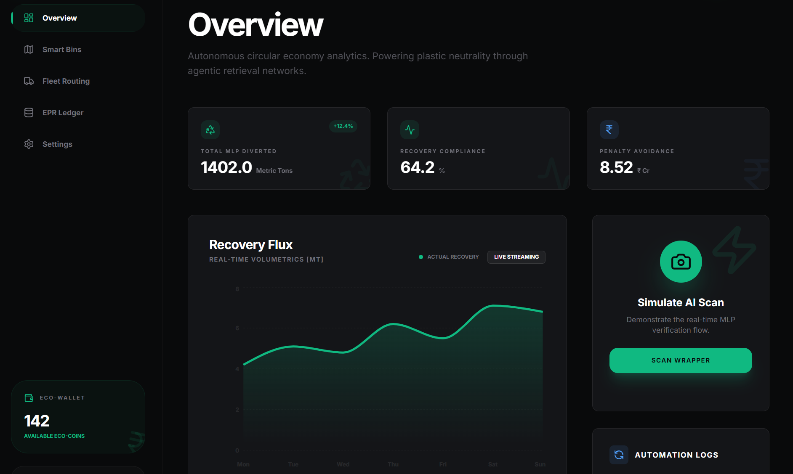
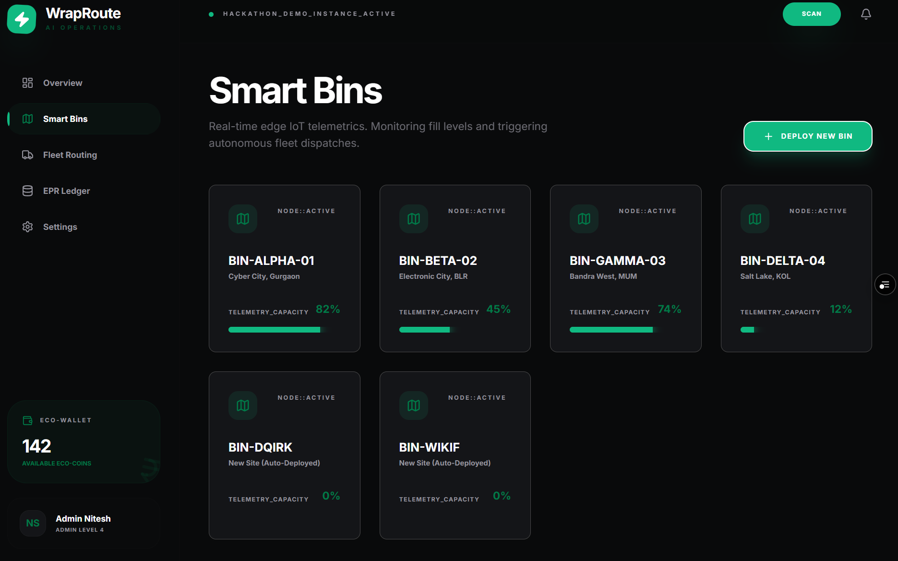
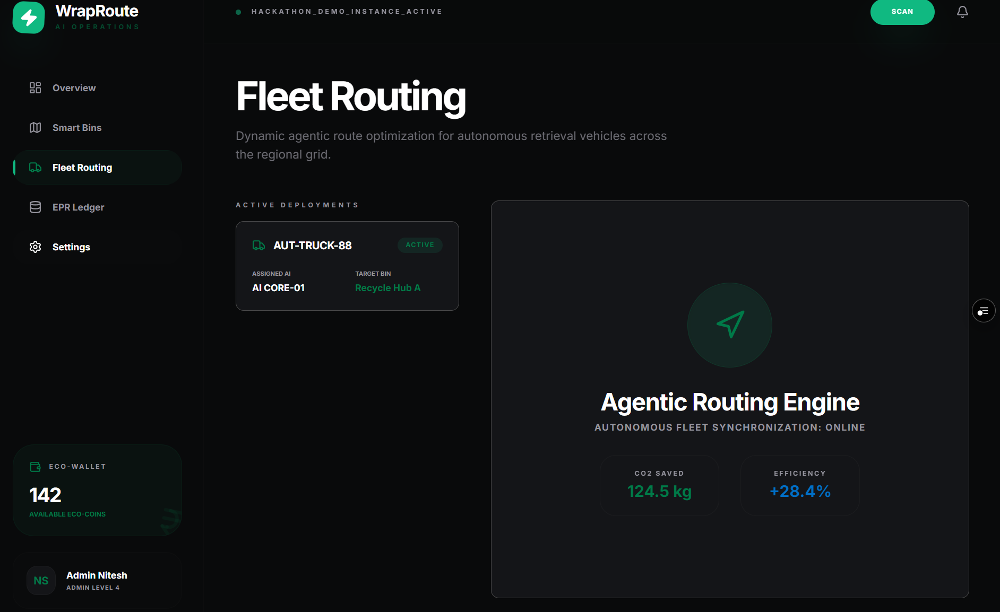
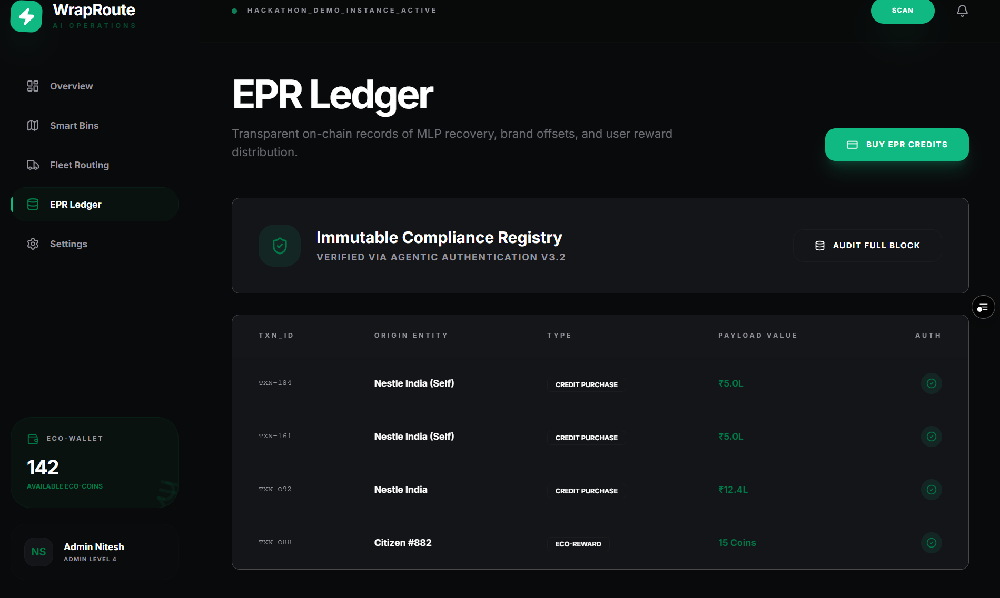

# ♻️ WrapRoute AI
**Solution Challenge 2026 Prototype** *An AI-Driven Decentralised Circular Economy for Multi-Layered Plastics.*

🌍 **Live Prototype:** [Click here to view Live App](https://wrape-route.vercel.app)  
▶️ **Demo Video:** [Insert Demo Video Link Here]

---

## 📸 Dashboard Previews

### 1. Operations Overview

### 2. Smart Bins Telemetry

### 3. Agentic Fleet Routing

### 4. AI Wrapper Scan (Gemini 1.5 Flash)

### 5. EPR Ledger (Compliance Registry)

---

## 🚀 The Problem We Are Solving
**Theme:** Smart Supply Chains & Circular Economy  
Current waste management lacks real-time tracking, accurate segregation at the source, and automated logistics for Multi-Layered Plastics (MLPs). This results in massive environmental pollution and non-compliance with Extended Producer Responsibility (EPR) regulations.

## 💡 Our Solution
WrapRoute AI builds a transparent, AI-powered reverse supply chain to optimize waste collection. By deploying edge-hardware (Smart Bins) and gamifying consumer disposal, we turn waste into traceable digital assets.

### 🔥 Key Features
* **🤖 Gemini Vision Engine:** Real-time AI validation of disposed wrappers to ensure zero contamination and prevent fraud.
* **🗑️ IoT Smart Bins:** Real-time telemetrics monitoring bin fill levels.
* **🚚 Agentic Routing:** Autonomous fleet dispatch triggered when bins hit 90% capacity, saving CO2 and operational costs.
* **🔗 Immutable EPR Ledger:** Transparent on-chain records of MLP recovery for brand compliance.

## 🛠️ Tech Stack
* **Frontend:** React.js, Vite, Tailwind CSS
* **Backend & Database:** Supabase (PostgreSQL)
* **AI Model:** Google Gemini 1.5 Flash API
* **Deployment:** Vercel
